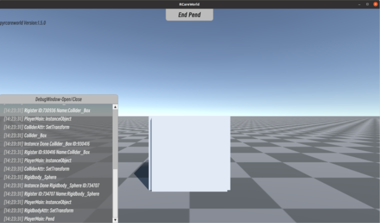

# Here is the code for RCareWorld PhyRC Challenge 🦾
This README contains instructions for installing the PhyRC version of RCareWorld. In addition to this README, please refer to the following links:

- Website https://emprise.cs.cornell.edu/rcareworld/
- Documentation: https://rcareworld.readthedocs.io/en/phy-robo-care/ Please only refer to this document if you are participating in the PhyRC challenge. Please don't use the links in the main branch. 
- Discussion Forum: https://github.com/empriselab/RCareWorld/discussions


# Hardware Requirements
While RCareWorld supports Linux, Windows, and Mac (experimental), our evaluation platform is based on Ubuntu 20.04. We do not guarantee the simulation environments for the competition work on MacOS, Windows, or other Linux versions as intended. The executable files are only for Linux systems. If you want to use Windows, you might consider using [WSL](https://learn.microsoft.com/en-us/windows/wsl/install) which ideally has the same functionality as Ubuntu.

We highly recommend using an Ubuntu 20.04 system which will be used for evaluation. For this competition, all tutorials are based on the Ubuntu system.

Please ensure your computer has at least 10GB of free space before starting. One or multiple discrete graphics cards with proper drivers are highly recommended, without which the simulation will be slow.

# Install Guide
## Pre-install Guide
Before starting, make sure Conda is installed on your computer.
For details, refer to the Conda installation guide: [Conda Installation Guide](https://docs.conda.io/projects/conda/en/latest/user-guide/install/index.html).

If you have an NVIDIA GPU, install an NVIDIA Driver from the official [NVIDIA Driver Downloads](https://www.nvidia.com/Download/index.aspx).

Install the necessary libraries:
```
sudo apt-get update
sudo apt-get install libassimp-dev libopenblas-dev liblapack-dev
```

## Install RCareWorld
Then you can install the RCareWorld!

<!-- - Clone the repo: `git clone https://github.com/empriselab/RCareWorld.git`
- Switch to the `phy-robo-care` branch: `cd RCareWorld` and then `git checkout phy-robo-care ` -->
Clone the `phy-robo-care` branch of the repo: 

`git clone -b phy-robo-care https://github.com/empriselab/RCareWorld.git`

<!-- - Create a conda environment with Python 3.10: `conda create -n rcareworld python=3.10`
- Activate the conda environment: `conda activate rcareworld`
- Install the requirements: `cd pyrcareworld` and then `pip install -r requirements.txt`
- Install pyrcareworld: `pip install -e .`
- Verify the installation works: `cd pyrcareworld/demo/examples` and run `python test_scene.py`. You should expect to see the RCareWorld Unity executable window pop up with a white cube. -->

```
# Create a conda environment with Python 3.10
conda create -n rcareworld python=3.10

# Activate the conda environment 
conda activate rcareworld

# Install the requirements
cd RCareWorld/pyrcareworld
pip install -r requirements.txt
pip install -e .

# To use open3d
pip uninstall numpy
conda install numpy

# Verify the installation works
cd pyrcareworld/demo/examples
python test_scene.py

```
A window with white cubes will pop up as the screenshot shows. This indicates the installation is successful.

You can perform common Unity operations in this window:
- `WSAD` to navigate
- `CTRL` to ascend 
- `Space` to descend 
- `Right Click` to pan
- `End Pend` allows you to perform special operations; refer to the code for details. Clicking three times will close the window, but you can also manually cancel in the code
- `Scroll` wheel direction is **opposite** to the direction in the DebugWindow




 
# Get Started with the Examples
Check the examples in the `pyrcareworld/pyrcareworld/demo/examples` folder. 

Go through the examples, run the examples, and read the comments in the code to understand the corresponding output and related APIs. 

Specifically, we have examples for people interested in performing traditional motion planning using OMPL as well as reinforcement learning using Gym.
- Motion planning: https://github.com/empriselab/RCareWorld/blob/phy-robo-care/pyrcareworld/pyrcareworld/demo/examples/example_ompl.py
- RL: https://github.com/empriselab/RCareWorld/blob/phy-robo-care/pyrcareworld/pyrcareworld/demo/examples/example_rl.py

# Starter Scripts for Bathing and Dressing Tasks
Check out `RCareWorld/template/test_bathing.py` and `RCareWorld/template/test_dressing.py` to get an overall idea about how to use the simulation environments for the dressing and bathing tasks. 

These two files are without graphics rendering to make them compatible with the docker environment. If you want to use them with rendering in your local environment, add the `--graphics` when you run the code.
```
# An example is as the following.
# For docker
python test_bathing.py
# For local use with rendering
python test_bathing.py --graphics
```
You can also test `test_dressing.py` in the same way, but please note that the **dressing scene will occupy more memory**. 

Please ensure that your computer has sufficient memory, or close unnecessary running programs in advance to improve the frame rate during execution!


Your score will be stored in a JSON file called `spongeScore.json` for bathing and `dressingScore.json` for dressing under `~/.config/unity3d/RCareWorld/BathingPlayer/` for bathing and `~/.config/unity3d/RCareWorld/DressingPlayer/` for dressing.

# Submit to EvalAI
Once you are done with your solutions, submit your code to EvalAI following [this](https://rcareworld.readthedocs.io/en/phy-robo-care/submission.html) tutorial. Remember, you need to sign up as a team on EvalAI before Sep 8 (11:59pm AoE) to participate.

# Online Office Hours
Book an appointment [here](https://calendar.google.com/calendar/u/0/appointments/schedules/AcZssZ0t_n2vlbhIcJTSNv0NY7_Z_Y3j2g5EsL0cKIgsB1phr07oFP9kA50c5WeS0Annn4H6sVexYWt1?gv=true). You may book multiple slots if your question is estimated to take more than 5 minutes, but do not book more than 4 slots per day. You may book the appointments 2 hours in advance.
